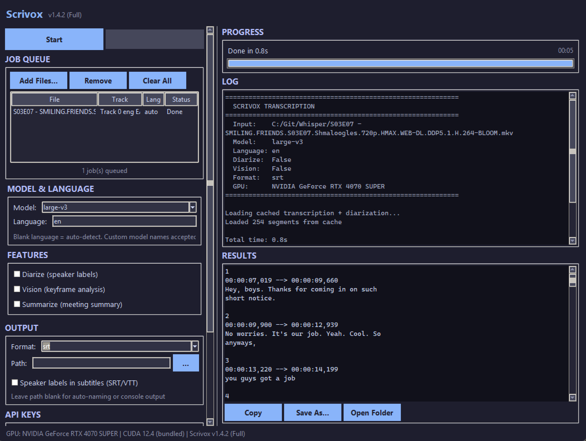

# Scrivox

GPU-accelerated transcription suite with speaker diarization, LLM translation, SRT subtitle generation, visual context analysis, and meeting summarization.

---



## Features

- **Transcription** — faster-whisper on CUDA with float16 precision
- **Speaker Diarization** — identify who said what via pyannote
- **LLM Translation** — translate transcripts to one or many languages simultaneously (e.g. `ar,fr,ja`), producing a separate output file per language. Optionally translate summaries, vision descriptions, and document headers too.
- **SRT/VTT Subtitles** — subtitle files with optional speaker labels
- **Multi-Language** — auto-detect or specify primary language; per-segment language detection for mixed content (Korean+English, etc.)
- **Vision Analysis** — extract video keyframes and describe them with vision LLMs
- **Meeting Summary** — structured summaries with action items and key points
- **Multiple LLM Providers** — OpenRouter, OpenAI, Anthropic, Ollama, or any OpenAI-compatible endpoint
- **6 Output Formats** — txt, md, srt, vtt, json, tsv
- **GUI + CLI** — Tkinter desktop app or full command-line interface
- **Multi-Track Audio** — select specific audio tracks from multi-track video files
- **Batch Processing** — queue multiple files with drag-and-drop
- **Smart Caching** — transcription and diarization results cached per-file; cache auto-invalidates when model, language, or diarization params change
- **Portable Config** — JSON config stored next to the executable

## Quick Start

### GUI

Double-click `Scrivox.exe` or run without arguments:

```
python main.py
```

### CLI

```bash
# Basic transcription
python main.py meeting.mp3

# Diarized SRT subtitles
python main.py video.mp4 --diarize --format srt -o subtitles.srt

# Full pipeline: diarize + vision + summary
python main.py meeting.mp4 --all --format md -o minutes.md

# Custom speaker names
python main.py meeting.mp4 --diarize --speaker-names "Alice,Bob,Charlie"

# Translate transcript to Arabic
python main.py meeting.mp3 --translate-to ar --format srt

# Translate to multiple languages at once (produces file.ar.srt, file.fr.srt, file.ja.srt)
python main.py meeting.mp3 --translate-to ar,fr,ja --format srt

# Translate everything: transcript + summary + vision + headers
python main.py meeting.mp4 --all --translate-to fr --translate-all --format md

# Korean drama with mixed language detection
python main.py kdrama.mp4 --language ko --format srt

# Use Anthropic Claude for translation/summary
python main.py meeting.mp3 --summarize --anthropic-key sk-ant-...

# Use OpenAI instead of OpenRouter
python main.py meeting.mp3 --summarize --api-base https://api.openai.com/v1/chat/completions --api-key sk-...

# Use local Ollama
python main.py meeting.mp3 --summarize --api-base http://localhost:11434/v1/chat/completions

# All features with JSON output
python main.py video.mp4 --all -f json -o report.json
```

### Dictation (Real-Time)

```bash
python dictate.py
# Hold Ctrl+Shift to record, release to transcribe and type
# Ctrl+Shift+Q to quit
```

## Installation

### From Release (Recommended)

1. Download the latest release from [Releases](https://github.com/Deenyoro/Scrivox/releases)
2. Extract the `.7z` archive
3. Copy `.env.example` to `.env` and add your API keys
4. Run `Scrivox.exe`

Three variants are available:

| Variant | Size | Description |
|---------|------|-------------|
| **Scrivox-Lite** | ~200-300 MB | Transcription only, no diarization |
| **Scrivox-Regular** | ~500-800 MB | All features, provide your own HuggingFace token |
| **Scrivox-Full** | ~1.5-2 GB | All features with diarization models pre-bundled |

### From Source

```bash
git clone https://github.com/Deenyoro/Scrivox.git
cd Scrivox
pip install -r requirements.txt
python main.py
```

### Custom Models

You can provide your own models by placing them in a `models/` directory next to the executable:

```
Scrivox/
  Scrivox.exe
  models/
    whisper/
      large-v3/          # Custom Whisper model (CTranslate2 format)
    hub/                  # Custom HuggingFace models (diarization)
```

## Requirements

- **Windows 10/11** (64-bit)
- **NVIDIA GPU** with CUDA support
- **ffmpeg** in PATH ([download](https://ffmpeg.org/download.html))

## API Keys

Add to `.env` file or enter in the GUI:

| Key | Required For | Get One |
|-----|-------------|---------|
| `HF_TOKEN` | Speaker diarization (Regular variant) | [huggingface.co/settings/tokens](https://huggingface.co/settings/tokens) |
| `OPENROUTER_API_KEY` | Vision, summary, translation (if using OpenRouter) | [openrouter.ai/keys](https://openrouter.ai/keys) |

> **Note:** The Full variant has diarization models bundled — no HuggingFace token needed.
> Vision, summary, and translation features work with any OpenAI-compatible API provider or Anthropic.

For diarization with the Lite variant, you must also accept the model license at [pyannote/speaker-diarization-3.1](https://huggingface.co/pyannote/speaker-diarization-3.1).

## LLM Providers

Scrivox supports multiple API providers for vision, summary, and translation features:

| Provider | Setup |
|----------|-------|
| **OpenRouter** (default) | Set `OPENROUTER_API_KEY` in `.env` |
| **OpenAI** | Use `--api-base https://api.openai.com/v1/chat/completions --api-key sk-...` |
| **Anthropic** | Use `--anthropic-key sk-ant-...` (auto-sets the Anthropic Messages API base) |
| **Ollama** (local) | Run Ollama locally, use `--api-base http://localhost:11434/v1/chat/completions` |
| **Custom** | Any endpoint that accepts the OpenAI chat completions format |

In the GUI, select your provider from the dropdown in the API Keys section.

## CLI Reference

```
python main.py <input> [options]

Options:
  --model MODEL              Whisper model: tiny, base, small, medium, large-v3
  --language LANG            Primary language code (en, ko, ja, etc.) or auto-detect
  --format FORMAT            Output: txt, md, srt, vtt, json, tsv
  --output PATH, -o PATH     Output file path

Speaker Diarization:
  --diarize                  Enable speaker diarization
  --num-speakers N           Exact speaker count (if known)
  --min-speakers N           Minimum speakers expected
  --max-speakers N           Maximum speakers expected
  --speaker-names NAMES      Comma-separated names: "Alice,Bob"
  --diarization-model MODEL  Diarization model ID or local path

Vision Analysis:
  --vision                   Analyze video keyframes with vision LLM
  --vision-interval SEC      Seconds between keyframes (default: 60)
  --vision-model MODEL       Vision model (default: google/gemini-2.5-flash)
  --vision-workers N         Concurrent vision API requests (default: 4)

Meeting Summary:
  --summarize                Generate meeting summary
  --summary-model MODEL      Summary model (default: google/gemini-2.5-flash)

Translation:
  --translate-to LANGS       Target language(s), comma-separated: "ar" or "ar,fr,ja"
  --translate-all            Also translate summary, vision, and headers
  --translation-model MODEL  Translation model (default: google/gemini-2.5-flash)

Subtitle Tuning:
  --subtitle-speakers        Show speaker labels in SRT/VTT (off by default)
  --subtitle-max-chars N     Max characters per subtitle cue (default: 84)
  --subtitle-max-duration S  Max seconds per subtitle cue (default: 4.0)
  --subtitle-max-gap S       Max gap in seconds to merge across (default: 0.8)
  --subtitle-min-chars N     Min characters per cue when splitting (default: 15)

API & Credentials:
  --api-base URL             LLM API endpoint (default: OpenRouter)
  --api-key KEY              LLM API key for vision/summary/translation
  --anthropic-key KEY        Anthropic API key (auto-sets Anthropic base URL)
  --hf-token TOKEN           HuggingFace token for diarization

Audio Tracks:
  --list-tracks              List audio tracks in the input file
  --audio-track N            Select audio track index (default: 0)

Other:
  --all                      Enable diarize + vision + summarize
  --clear-cache              Force re-transcription
  --confidence-threshold F   Min avg word probability to keep a segment (default: 0.50)
```

## Building from Source

```bash
# Install build dependencies
pip install pyinstaller

# Build both variants (Full requires HF_TOKEN env var)
python build.py --clean

# Build only Lite variant (no models needed)
python build.py --lite

# Build only Full variant (downloads diarization models)
set HF_TOKEN=hf_your_token_here
python build.py --full
```

## Project Structure

```
scrivox/
  __init__.py              Package metadata
  cli.py                   CLI entry point (argparse -> pipeline)
  gui.py                   GUI entry point
  config.py                JSON config manager
  core/
    constants.py           Models, languages, extensions, LLM providers
    features.py            Runtime feature detection (Lite/Regular/Full)
    llm_client.py          Unified LLM API client (OpenAI + Anthropic formats)
    torch_compat.py        PyTorch 2.6+ compatibility
    media.py               ffmpeg utilities (extract, probe, duration)
    transcriber.py         Whisper transcription + post-processing
    diarizer.py            Speaker diarization (pyannote)
    translator.py          LLM-based segment/text/header translation
    vision.py              Keyframe extraction + vision LLM
    summarizer.py          Meeting summary generation
    formatter.py           Output formatting (6 formats)
    pipeline.py            Pipeline orchestrator (PipelineConfig -> run)
  ui/
    app.py                 Main application window
    theme.py               Dark theme configuration
    widgets.py             Reusable widgets (autocomplete combobox)
    log_redirect.py        Thread-safe stdout -> log widget
    dialogs/
      track_dialog.py      Audio track selection dialog
    frames/
      queue_frame.py       Job queue + multi-file browse + drag-and-drop
      settings_frame.py    Model, language, feature toggles + sub-settings
      models_frame.py      Advanced model and tuning settings
      api_frame.py         Provider selection + API key management
      output_frame.py      Format + output path
      progress_frame.py    Progress bar + elapsed timer
      log_frame.py         Scrollable log display (batched inserts)
      results_frame.py     Transcript display + copy/save
```

---

**KawaConnect LLC** | Built by Deenyoro
